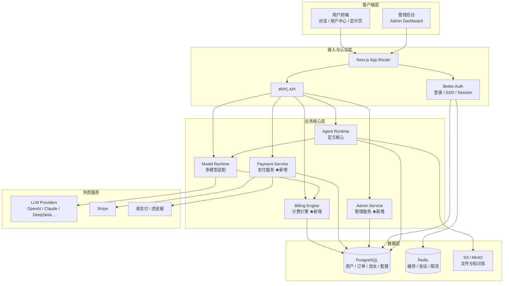
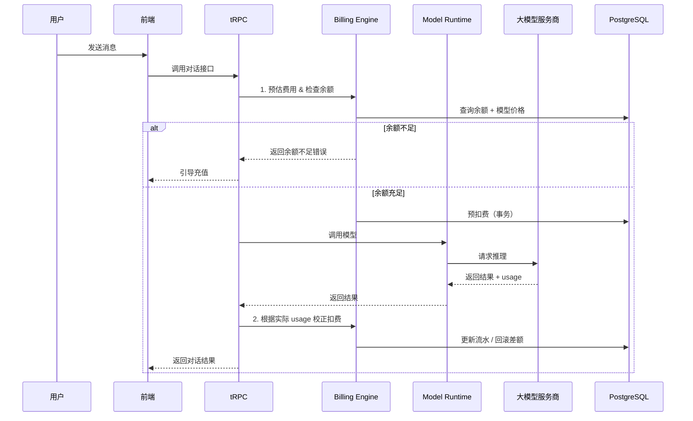
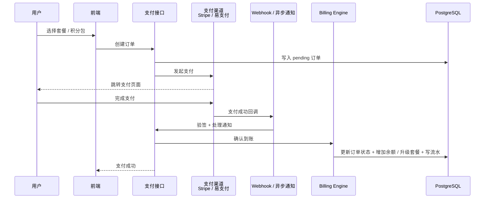

# Wedai

> 基于 [LobeHub](https://github.com/lobehub/lobehub) 深度二次开发的商业化 AI Agent 平台

**Wedai** 致力于打造一套可独立运营、可规模化变现的 AI 对话与 Agent 服务系统。  
在完整保留 LobeHub 强大 Agent 能力的基础上，重点补齐**用户体系、付费订阅、积分计费、管理后台**等商业化核心模块。

---

## 一、项目定位

本项目采用 **方案 C：完全自主二次开发** 路线。

- 不依赖社区现成商业化 fork（如 lobe-chat-pro）
- 以官方最新代码为基座，自行扩展商业化能力
- 目标是形成可长期维护、可对外售卖服务的独立产品

### 核心目标

1. **完整的用户与权限体系**（注册登录、角色、邀请）
2. **灵活的付费与计费系统**（订阅套餐 + 积分充值）
3. **精确的模型调用扣费**（支持按 Token / 按次计费）
4. **专业的管理后台**（用户、订单、价格、数据看板）
5. **尽量保持与官方 upstream 的可同步性**

---

## 二、核心功能规划

### 1. 用户系统
- 复用官方 **Better Auth**（邮箱密码 + Google / GitHub / Microsoft 等 SSO）
- 扩展用户字段：余额、套餐、套餐到期时间、邀请码、邀请人、累计充值/消费
- 角色权限：普通用户 / 管理员 / 超级管理员
- 注册赠送积分、邀请奖励机制

### 2. 付费系统
- **国际支付**：Stripe（订阅 + 一次性积分包）
- **国内支付**：易支付 / 虎皮椒（微信、支付宝）
- 支持套餐订阅（月付 / 年付）与积分包充值两种模式
- 完整的订单创建 → 支付 → 回调验签 → 到账流程
- 支付失败、超时、退款处理

### 3. 计费引擎
- 模型价格可后台动态配置（输入 Token 单价、输出 Token 单价、按次价格）
- 模型调用前预估扣费 + 调用后实际校正
- 余额不足时拦截请求并引导充值
- 消费失败自动回滚
- 完整流水记录（充值、消费、退款、赠送、邀请分成）

### 4. 管理后台
- 用户管理（搜索、封禁、调整余额、修改套餐）
- 订单与流水查询
- 模型价格配置
- 套餐管理
- 系统参数配置（注册赠送额度、邀请分成比例等）
- 数据看板（今日/本月充值、消耗、新增用户、活跃用户）

### 5. 前端用户侧
- 定价页面
- 用户中心（余额、当前套餐、消费记录、订单记录）
- 充值 / 升级套餐流程
- 邀请好友页面

---

## 三、技术栈

| 层级 | 技术 |
|------|------|
| 框架 | Next.js（App Router）+ React 19 |
| 语言 | TypeScript |
| 状态管理 | Zustand |
| API | tRPC（端到端类型安全） |
| 认证 | Better Auth |
| 数据库 | PostgreSQL + Drizzle ORM |
| 缓存 | Redis |
| 对象存储 | S3 兼容（MinIO / 云厂商） |
| UI | Ant Design + @lobehub/ui |
| 支付 | Stripe + 易支付 / 虎皮椒 |
| 部署 | Docker Compose / Vercel + 外部数据库 |

---

## 四、系统架构

### 4.1 整体架构图



### 4.2 架构分层说明

| 层级 | 职责 | 关键组件 |
|------|------|----------|
| **客户端层** | 用户交互与管理操作 | 用户前端（对话、充值、用户中心）、管理后台 |
| **接入与认证层** | 路由、身份认证、API 入口 | Next.js、Better Auth、tRPC |
| **业务核心层** | 核心业务逻辑 | Agent Runtime（官方）、Model Runtime（官方）、**Billing Engine（新增）**、**Payment Service（新增）**、**Admin Service（新增）** |
| **数据层** | 持久化与缓存 | PostgreSQL（主库）、Redis（缓存/限流）、S3（文件存储） |
| **外部服务** | 第三方能力 | 各大 LLM 服务商、Stripe、易支付/虎皮椒 |

### 4.3 核心调用链路（计费重点）



### 4.4 支付到账流程



### 4.5 设计原则

1. **官方核心尽量不改**：Agent Runtime 与 Model Runtime 保持原样，计费逻辑通过中间件切入。
2. **计费与业务解耦**：Billing Engine 作为独立 package，方便测试与后续替换。
3. **支付渠道可插拔**：Payment Service 采用适配器模式，方便同时支持 Stripe 和国内支付。
4. **数据一致性优先**：所有涉及余额变动的操作必须走数据库事务，并记录不可篡改的流水。
5. **前后端类型安全**：全程使用 tRPC + TypeScript，减少接口错误。

---

## 五、开发计划（详细）

| 阶段 | 时间预估 | 主要内容 | 状态 |
|------|----------|----------|------|
| **Phase 1** | 1 周 | 扩展数据库 Schema、用户表字段、迁移脚本 | 待开始 |
| **Phase 2** | 1–1.5 周 | 支付中心（先完成 Stripe 或易支付其中一个） | 待开始 |
| **Phase 3** | 1–1.5 周 | 计费中间件、模型调用扣费逻辑、流水记录 | 待开始 |
| **Phase 4** | 1 周 | 用户中心、充值弹窗、定价页前端 | 待开始 |
| **Phase 5** | 1.5–2 周 | 管理后台核心功能（用户、订单、价格、套餐） | 待开始 |
| **Phase 6** | 1 周 | 邀请系统、套餐权限控制、注册赠送 | 待开始 |
| **Phase 7** | 1 周 | 对账脚本、操作日志、异常处理、安全加固 | 待开始 |
| **Phase 8** | 持续 | 与官方 upstream 同步、性能优化、功能迭代 | 待开始 |

---

## 六、推荐目录结构

为了尽量减少与官方代码的冲突，商业化相关代码建议独立隔离：

```text
Wedai/
├── packages/
│   ├── database/                 # 扩展官方 Drizzle Schema
│   │   └── src/schemas/
│   │       ├── user.ts           # 用户表扩展字段
│   │       ├── billing.ts        # 订单、流水、套餐、价格表
│   │       └── ...
│   ├── billing/                  # 【新增】计费引擎核心逻辑
│   │   ├── src/
│   │   │   ├── calculate.ts      # 费用计算
│   │   │   ├── deduct.ts         # 扣费与回滚
│   │   │   ├── payment/          # 支付渠道适配
│   │   │   └── types.ts
│   └── admin/                    # 【新增】管理后台相关共享逻辑
│
├── src/
│   ├── features/
│   │   ├── billing/              # 用户侧支付、充值、流水相关页面与逻辑
│   │   ├── admin/                # 管理后台页面
│   │   └── user-center/          # 用户中心
│   ├── server/
│   │   └── routers/
│   │       └── billing.ts        # tRPC 计费相关路由
│   └── ...
│
├── docs/                         # 项目内部文档
│   ├── architecture.md
│   ├── database.md
│   ├── payment.md
│   └── sync-upstream.md
└── ...
```

---

## 七、数据库核心表设计（概览）

| 表名 | 说明 |
|------|------|
| `users`（扩展） | 增加 balance、plan、plan_expire_at、invite_code、invited_by、role 等字段 |
| `plans` | 套餐定义（名称、价格、月积分额度、功能开关） |
| `orders` | 订单表（充值、订阅） |
| `transactions` | 资金流水（充值、消费、退款、赠送、邀请分成） |
| `model_prices` | 模型价格配置（支持按 Token / 按次） |
| `invite_records` | 邀请关系与奖励记录 |
| `admin_logs` | 管理员操作日志 |

> 所有金额字段统一使用 `decimal`，禁止使用浮点数。

---

## 八、重要注意事项

### 1. License 合规
LobeHub 使用 Apache 2.0 + 商业附加条款。  
**对二次开发并对外商业化（修改品牌、提供付费服务）有明确要求**。  
正式上线前请务必联系官方获取商业授权：

- 邮箱：hello@lobehub.com

### 2. 与官方代码同步策略
- 商业化代码尽量放在独立目录 / package，避免直接修改官方核心文件
- 建议使用 `git subtree` 或定期 cherry-pick 的方式同步官方更新
- 重大版本升级前先在独立分支充分测试

### 3. 安全要求
- 支付回调必须严格验签
- 余额扣减必须使用数据库事务 + 乐观锁
- 敏感操作记录管理员日志
- 生产环境禁止将支付密钥写入前端或公开仓库

### 4. 当前仓库状态
- 仓库为 **私有**
- 目前仅完成项目初始化与文档规划
- 正式开发后将按阶段逐步提交代码

---

## 九、快速开始（待完善）

后续将补充以下内容：

1. 如何基于官方 LobeHub 仓库初始化本项目
2. 本地开发环境搭建步骤
3. 数据库迁移命令
4. 支付渠道测试配置说明
5. 管理后台访问方式

---

## 十、维护者

- GitHub：[@1004cq](https://github.com/1004cq)

---

**Wedai** —— 让 AI Agent 真正具备可持续的商业化能力。
