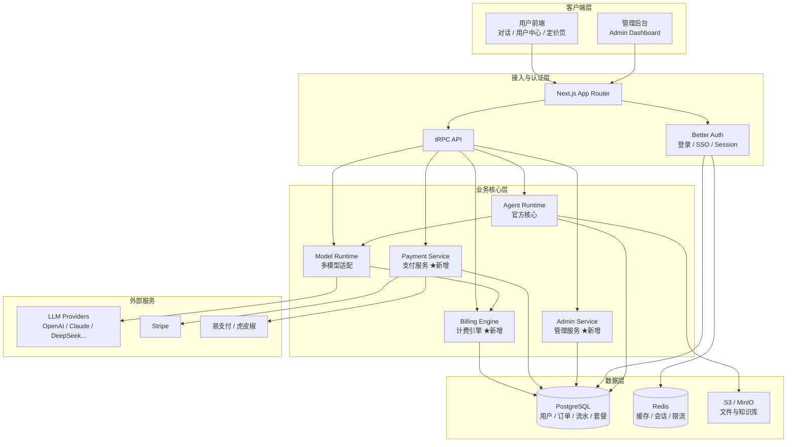
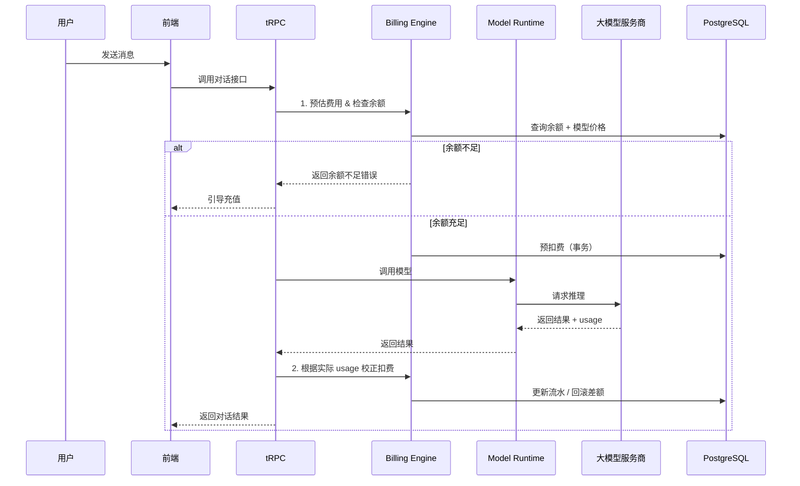
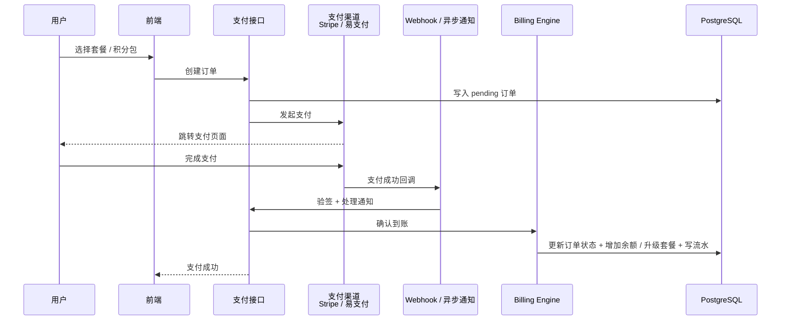

# Wedai

> 基于 [LobeHub](https://github.com/lobehub/lobehub) 深度二次开发的商业化 AI Agent 平台

**Wedai** 致力于打造一套可独立运营、可规模化变现的 AI 对话与 Agent 服务系统。  
在完整保留 LobeHub 强大 Agent 能力的基础上，重点补齐**用户体系、付费订阅、积分计费、管理后台**等商业化核心模块。

---

## 一、项目定位

本项目采用 **方案 C：完全自主二次开发** 路线。

- 不依赖社区现成商业化 fork（如 lobe-chat-pro）
- 以官方最新代码为基座，自行扩展商业化能力
- 目标是形成可长期维护、可对外售卖服务的独立产品

### 核心目标

1. **完整的用户与权限体系**（注册登录、角色、邀请）
2. **灵活的付费与计费系统**（订阅套餐 + 积分充值）
3. **精确的模型调用扣费**（支持按 Token / 按次计费）
4. **专业的管理后台**（用户、订单、价格、数据看板）
5. **尽量保持与官方 upstream 的可同步性**

---

## 二、核心功能规划

### 1. 用户系统
- 复用官方 **Better Auth**（邮箱密码 + Google / GitHub / Microsoft 等 SSO）
- 扩展用户字段：余额、套餐、套餐到期时间、邀请码、邀请人、累计充值/消费
- 角色权限：普通用户 / 管理员 / 超级管理员
- 注册赠送积分、邀请奖励机制

### 2. 付费系统
- **国际支付**：Stripe（订阅 + 一次性积分包）
- **国内支付**：易支付 / 虎皮椒（微信、支付宝）
- 支持套餐订阅（月付 / 年付）与积分包充值两种模式
- 完整的订单创建 → 支付 → 回调验签 → 到账流程
- 支付失败、超时、退款处理

### 3. 计费引擎
- 模型价格可后台动态配置（输入 Token 单价、输出 Token 单价、按次价格）
- 模型调用前预估扣费 + 调用后实际校正
- 余额不足时拦截请求并引导充值
- 消费失败自动回滚
- 完整流水记录（充值、消费、退款、赠送、邀请分成）

### 4. 管理后台
- 用户管理（搜索、封禁、调整余额、修改套餐）
- 订单与流水查询
- 模型价格配置
- 套餐管理
- 系统参数配置（注册赠送额度、邀请分成比例等）
- 数据看板（今日/本月充值、消耗、新增用户、活跃用户）

### 5. 前端用户侧
- 定价页面
- 用户中心（余额、当前套餐、消费记录、订单记录）
- 充值 / 升级套餐流程
- 邀请好友页面

---

## 三、技术栈

| 层级 | 技术 |
|------|------|
| 框架 | Next.js（App Router）+ React 19 |
| 语言 | TypeScript |
| 状态管理 | Zustand |
| API | tRPC（端到端类型安全） |
| 认证 | Better Auth |
| 数据库 | PostgreSQL + Drizzle ORM |
| 缓存 | Redis |
| 对象存储 | S3 兼容（MinIO / 云厂商） |
| UI | Ant Design + @lobehub/ui |
| 支付 | Stripe + 易支付 / 虎皮椒 |
| 部署 | Docker Compose / Vercel + 外部数据库 |

---

## 四、系统架构

### 4.1 整体架构图



### 4.2 架构分层说明

| 层级 | 职责 | 关键组件 |
|------|------|----------|
| **客户端层** | 用户交互与管理操作 | 用户前端（对话、充值、用户中心）、管理后台 |
| **接入与认证层** | 路由、身份认证、API 入口 | Next.js、Better Auth、tRPC |
| **业务核心层** | 核心业务逻辑 | Agent Runtime（官方）、Model Runtime（官方）、**Billing Engine（新增）**、**Payment Service（新增）**、**Admin Service（新增）** |
| **数据层** | 持久化与缓存 | PostgreSQL（主库）、Redis（缓存/限流）、S3（文件存储） |
| **外部服务** | 第三方能力 | 各大 LLM 服务商、Stripe、易支付/虎皮椒 |

### 4.3 核心调用链路（计费重点）



### 4.4 支付到账流程



### 4.5 设计原则

1. **官方核心尽量不改**：Agent Runtime 与 Model Runtime 保持原样，计费逻辑通过中间件切入。
2. **计费与业务解耦**：Billing Engine 作为独立 package，方便测试与后续替换。
3. **支付渠道可插拔**：Payment Service 采用适配器模式，方便同时支持 Stripe 和国内支付。
4. **数据一致性优先**：所有涉及余额变动的操作必须走数据库事务，并记录不可篡改的流水。
5. **前后端类型安全**：全程使用 tRPC + TypeScript，减少接口错误。

---

## 五、开发计划（详细）

| 阶段 | 时间预估 | 主要内容 | 状态 |
|------|----------|----------|------|
| **Phase 1** | 1 周 | 扩展数据库 Schema、用户表字段、迁移脚本 | 待开始 |
| **Phase 2** | 1–1.5 周 | 支付中心（先完成 Stripe 或易支付其中一个） | 待开始 |
| **Phase 3** | 1–1.5 周 | 计费中间件、模型调用扣费逻辑、流水记录 | 待开始 |
| **Phase 4** | 1 周 | 用户中心、充值弹窗、定价页前端 | 待开始 |
| **Phase 5** | 1.5–2 周 | 管理后台核心功能（用户、订单、价格、套餐） | 待开始 |
| **Phase 6** | 1 周 | 邀请系统、套餐权限控制、注册赠送 | 待开始 |
| **Phase 7** | 1 周 | 对账脚本、操作日志、异常处理、安全加固 | 待开始 |
| **Phase 8** | 持续 | 与官方 upstream 同步、性能优化、功能迭代 | 待开始 |

---

## 六、推荐目录结构

为了尽量减少与官方代码的冲突，商业化相关代码建议独立隔离：

```text
Wedai/
├── packages/
│   ├── database/                 # 扩展官方 Drizzle Schema
│   │   └── src/schemas/
│   │       ├── user.ts           # 用户表扩展字段
│   │       ├── billing.ts        # 订单、流水、套餐、价格表
│   │       └── ...
│   ├── billing/                  # 【新增】计费引擎核心逻辑
│   │   ├── src/
│   │   │   ├── calculate.ts      # 费用计算
│   │   │   ├── deduct.ts         # 扣费与回滚
│   │   │   ├── payment/          # 支付渠道适配
│   │   │   └── types.ts
│   └── admin/                    # 【新增】管理后台相关共享逻辑
│
├── src/
│   ├── features/
│   │   ├── billing/              # 用户侧支付、充值、流水相关页面与逻辑
│   │   ├── admin/                # 管理后台页面
│   │   └── user-center/          # 用户中心
│   ├── server/
│   │   └── routers/
│   │       └── billing.ts        # tRPC 计费相关路由
│   └── ...
│
├── docs/                         # 项目内部文档
│   ├── architecture.md
│   ├── database.md
│   ├── payment.md
│   └── sync-upstream.md
└── ...
```

---

## 七、数据库核心表设计（概览）

| 表名 | 说明 |
|------|------|
| `users`（扩展） | 增加 balance、plan、plan_expire_at、invite_code、invited_by、role 等字段 |
| `plans` | 套餐定义（名称、价格、月积分额度、功能开关） |
| `orders` | 订单表（充值、订阅） |
| `transactions` | 资金流水（充值、消费、退款、赠送、邀请分成） |
| `model_prices` | 模型价格配置（支持按 Token / 按次） |
| `invite_records` | 邀请关系与奖励记录 |
| `admin_logs` | 管理员操作日志 |

> 所有金额字段统一使用 `decimal`，禁止使用浮点数。

---

## 八、重要注意事项

### 1. License 合规
LobeHub 使用 Apache 2.0 + 商业附加条款。  
**对二次开发并对外商业化（修改品牌、提供付费服务）有明确要求**。  
正式上线前请务必联系官方获取商业授权：

- 邮箱：hello@lobehub.com

### 2. 与官方代码同步策略
- 商业化代码尽量放在独立目录 / package，避免直接修改官方核心文件
- 建议使用 `git subtree` 或定期 cherry-pick 的方式同步官方更新
- 重大版本升级前先在独立分支充分测试

### 3. 安全要求
- 支付回调必须严格验签
- 余额扣减必须使用数据库事务 + 乐观锁
- 敏感操作记录管理员日志
- 生产环境禁止将支付密钥写入前端或公开仓库

### 4. 当前仓库状态
- 仓库为 **私有**
- 目前仅完成项目初始化与文档规划
- 正式开发后将按阶段逐步提交代码

---

## 九、自托管 / 一键部署

Wedai 提供正式的 Docker Compose 自托管入口，包含 Web 应用、PostgreSQL、Redis、RustFS 与 SearXNG，并支持源码构建和预构建镜像两种模式。

```bash
./deploy/one-click-up.sh
```

首次运行会生成 `deploy/.env.commercial` 并提示填写密钥；完成配置后再次执行同一命令即可启动。完整的环境要求、域名配置、更新、回滚和排障说明见：

- [Wedai Docker 一键部署](./deploy/ONE_CLICK.md)
- [部署目录说明](./deploy/README.md)

> 当前商业付费、订单和计费模块仍是开发骨架；部署成功不代表这些尚未实现的能力已通过生产验收。

---

## 十、维护者

- GitHub：[@1004cq](https://github.com/1004cq)

---

**Wedai** —— 让 AI Agent 真正具备可持续的商业化能力。

---

## 官方 LobeHub 源码说明

以下内容保留自本次导入的官方 LobeHub `canary` README。

<div align="center"><a name="readme-top"></a>

[![][image-banner]][vercel-link]

# LobeHub

LobeHub organizes your agents into 7×24 operation.

It hires, schedules, reports on your entire AI team.

You stay in charge — without staying online.

**English** · [简体中文](./README.zh-CN.md) · [Official Site][official-site] · [Changelog][changelog] · [Documents][docs] · [Blog][blog] · [Feedback][github-issues-link]

<!-- SHIELD GROUP -->

[![][github-release-shield]][github-release-link]
[![][docker-release-shield]][docker-release-link]
[![][vercel-shield]][vercel-link]
[![][discord-shield]][discord-link]<br/>
[![][codecov-shield]][codecov-link]
[![][github-action-test-shield]][github-action-test-link]
[![][github-action-release-shield]][github-action-release-link]
[![][github-releasedate-shield]][github-releasedate-link]<br/>
[![][github-contributors-shield]][github-contributors-link]
[![][github-forks-shield]][github-forks-link]
[![][github-stars-shield]][github-stars-link]
[![][github-issues-shield]][github-issues-link]
[![][github-license-shield]][github-license-link]<br>

**Share LobeHub Repository**

[![][share-x-shield]][share-x-link]
[![][share-telegram-shield]][share-telegram-link]
[![][share-whatsapp-shield]][share-whatsapp-link]
[![][share-reddit-shield]][share-reddit-link]
[![][share-weibo-shield]][share-weibo-link]
[![][share-mastodon-shield]][share-mastodon-link]
[![][share-linkedin-shield]][share-linkedin-link]

<sup>Your Chief Agent Operator</sup>

<a href="https://www.producthunt.com/products/lobehub?embed=true&amp;utm_source=badge-top-post-badge&amp;utm_medium=badge&amp;utm_campaign=badge-lobehub-2" target="_blank" rel="noopener noreferrer"></a> <a href="https://trendshift.io/repositories/19224" target="_blank"></a>

[](https://vercel.com/oss)

</div>

> [!NOTE]
> **Wedai commercial edition scaffold** — this repository tracks the official LobeHub `canary`
> source and keeps proprietary billing, administration, user-center, and APISIX integration work
> isolated from upstream runtime cores. See [`docs/IMPORT_LOBEHUB.md`](./docs/IMPORT_LOBEHUB.md)
> for the import/sync workflow and [`docs/CODEX_TASK.md`](./docs/CODEX_TASK.md) for the
> commercialization boundary.

<details>
<summary><kbd>Table of contents</kbd></summary>

#### TOC

- [👋🏻 Getting Started & Join Our Community](#-getting-started--join-our-community)
- [✨ Features](#-features)
  - [Operator: Agents as the Unit of Work](#operator-agents-as-the-unit-of-work)
  - [Create: Agents as the Unit of Work](#create-agents-as-the-unit-of-work)
  - [Collaborate: Scale New Forms of Collaboration Networks](#collaborate-scale-new-forms-of-collaboration-networks)
  - [Evolve: Co-evolution of Humans and Agents](#evolve-co-evolution-of-humans-and-agents)
- [🛳 Self Hosting](#-self-hosting)
  - [`A` Deploying with Vercel, Zeabur , Sealos or Alibaba Cloud](#a-deploying-with-vercel-zeabur--sealos-or-alibaba-cloud)
  - [`B` Deploying with Docker](#b-deploying-with-docker)
  - [Environment Variable](#environment-variable)
  - [Obtain OpenAI API Key](#obtain-openai-api-key)
- [📦 Ecosystem](#-ecosystem)
- [🧩 Plugins](#-plugins)
- [⌨️ Local Development](#️-local-development)
- [🤝 Contributing](#-contributing)
- [❤️ Sponsor](#️-sponsor)
- [🔗 More Products](#-more-products)

####

<br/>

</details>

<br/>

<https://github.com/user-attachments/assets/0a33365f-b786-48b5-9ed6-f8af7927bccb>

## 👋🏻 Getting Started & Join Our Community

We are a group of e/acc design-engineers, hoping to provide modern design components and tools for AIGC.
By adopting the Bootstrapping approach, we aim to provide developers and users with a more open, transparent, and user-friendly product ecosystem.

Whether for users or professional developers, LobeHub will be your AI Agent playground. Please be aware that LobeHub is currently under active development, and feedback is welcome for any [issues][issues-link] encountered.

| [](https://www.producthunt.com/products/lobehub?launch=lobehub-2&embed=true&utm_source=badge-featured&utm_medium=badge&utm_campaign=badge-lobehub) | We are live on Product Hunt! We are thrilled to bring LobeHub to the world. If you believe in a future where humans and agents co-evolve, please support our journey. |
| :----------------------------------------------------------------------------------------------------------------------------------------------------------------------------------------------------------------------------------------------------------------- | :-------------------------------------------------------------------------------------------------------------------------------------------------------------------- |
| [![][discord-shield-badge]][discord-link]                                                                                                                                                                                                                          | Join our Discord community! This is where you can connect with developers and other enthusiastic users of LobeHub.                                                    |

> \[!IMPORTANT]
>
> **Star Us**, You will receive all release notifications from GitHub without any delay \~ ⭐️

[![][image-star]][github-stars-link]

<details>
  <summary><kbd>Star History</kbd></summary>
  <picture>
    <source media="(prefers-color-scheme: dark)" srcset="https://api.star-history.com/svg?repos=lobehub%2Flobehub&theme=dark&type=Date">
    
  </picture>
</details>

## ✨ Features

Today’s agents are one-off, task-driven tools. They lack context, live in isolation, and require manual hand-offs between different windows and models. While some maintain memory, it is often global, shallow, and impersonal. In this mode, users are forced to toggle between fragmented conversations, making it difficult to form structured productivity.

**LobeHub changes everything.**

LobeHub is a work-and-lifestyle space to find, build, and collaborate with agent teammates that grow with you. In LobeHub, we treat **Agents as the unit of work**, providing an infrastructure where humans and agents co-evolve.


### Operator: Agents as the Unit of Work

Hires, schedules, and reports on your entire AI team.

- **More productivity. Fewer tools**: Bring all your agents under one roof.
- **IM Gateway**: Agents where you already chat.


[![][back-to-top]](#readme-top)

<div align="right">

[![][back-to-top]](#readme-top)

</div>


### Create: Agents as the Unit of Work

Building a personalized AI team starts with the **Agent Builder**. You can describe what you need once, and the agent setup starts right away, applying auto-configurations so you can use it instantly.

- **Unified Intelligence**: Seamlessly access any model and any modality—all under your control.
- **10,000+ Skills**: Connect your agents to the skills you use every day with a library of over 10,000 tools and MCP-compatible plugins.


[![][back-to-top]](#readme-top)

<div align="right">

[![][back-to-top]](#readme-top)

</div>


### Collaborate: Scale New Forms of Collaboration Networks

LobeHub introduces **Agent Groups**, allowing you to work with agents like real teammates. The system assembles the right agents for the task, enabling parallel collaboration and iterative improvement.

- **Pages**: Write and refine content with multiple agents in one place with a shared context.
- **Schedule**: Schedule runs and let agents do the work at the right time, even while you are away.
- **Project**: Organize work by project to keep everything structured and easy to track.
- **Workspace**: A shared space for teams to collaborate with agents, ensuring clear ownership and visibility across the organization.


[![][back-to-top]](#readme-top)

<div align="right">

[![][back-to-top]](#readme-top)

</div>


### Evolve: Co-evolution of Humans and Agents

The best AI is one that understands you deeply. LobeHub features **Personal Memory** that builds a clear understanding of your needs.

- **Continual Learning**: Your agents learn from how you work, adapting their behavior to act at the right moment.
- **White-Box Memory**: We believe in transparency. Your agents use structured, editable memory, giving you full control over what they remember.


<div align="right">

[![][back-to-top]](#readme-top)

</div>

> ✨ more features will be added when LobeHub evolve.

<div align="right">

[![][back-to-top]](#readme-top)

</div>

## 🛳 Self Hosting

LobeHub provides Self-Hosted Version with Vercel, Alibaba Cloud, and [Docker Image][docker-release-link]. This allows you to deploy your own chatbot within a few minutes without any prior knowledge.

> \[!TIP]
>
> Learn more about [📘 Build your own LobeHub][docs-self-hosting] by checking it out.

### `A` Deploying with Vercel, Zeabur , Sealos or Alibaba Cloud

"If you want to deploy this service yourself on Vercel, Zeabur or Alibaba Cloud, you can follow these steps:

- Prepare your [OpenAI API Key](https://platform.openai.com/account/api-keys).
- Click the button below to start deployment: Log in directly with your GitHub account, and remember to fill in the `OPENAI_API_KEY`(required) on the environment variable section.
- After deployment, you can start using it.
- Bind a custom domain (optional): The DNS of the domain assigned by Vercel is polluted in some areas; binding a custom domain can connect directly.

<div align="center">

|           Deploy with Vercel            |                     Deploy with Zeabur                      |                     Deploy with Sealos                      |                       Deploy with RepoCloud                       |                         Deploy with Alibaba Cloud                         |
| :-------------------------------------: | :---------------------------------------------------------: | :---------------------------------------------------------: | :---------------------------------------------------------------: | :-----------------------------------------------------------------------: |
| [![][deploy-button-image]][deploy-link] | [![][deploy-on-zeabur-button-image]][deploy-on-zeabur-link] | [![][deploy-on-sealos-button-image]][deploy-on-sealos-link] | [![][deploy-on-repocloud-button-image]][deploy-on-repocloud-link] | [![][deploy-on-alibaba-cloud-button-image]][deploy-on-alibaba-cloud-link] |

</div>

#### After Fork

After fork, only retain the upstream sync action and disable other actions in your repository on GitHub.

#### Keep Updated

If you have deployed your own project following the one-click deployment steps in the README, you might encounter constant prompts indicating "updates available." This is because Vercel defaults to creating a new project instead of forking this one, resulting in an inability to detect updates accurately.

> \[!TIP]
>
> We suggest you redeploy using the following steps, [📘 Auto Sync With Latest][docs-upstream-sync]

<br/>

### `B` Deploying with Docker

[![][docker-release-shield]][docker-release-link]
[![][docker-size-shield]][docker-size-link]
[![][docker-pulls-shield]][docker-pulls-link]

We provide a Docker image for deploying the LobeHub service on your own private device. Use the following command to start the LobeHub service:

1. create a folder to for storage files

```fish
$ mkdir lobehub-db && cd lobehub-db
```

2. init the LobeHub infrastructure

```fish
bash <(curl -fsSL https://lobe.li/setup.sh)
```

3. Start the LobeHub service

```fish
docker compose up -d
```

> \[!NOTE]
>
> For detailed instructions on deploying with Docker, please refer to the [📘 Docker Deployment Guide][docs-docker]

<br/>

### Environment Variable

This project provides some additional configuration items set with environment variables:

| Environment Variable | Required | Description                                                                                                                                                               | Example                                                                                                              |
| -------------------- | -------- | ------------------------------------------------------------------------------------------------------------------------------------------------------------------------- | -------------------------------------------------------------------------------------------------------------------- |
| `OPENAI_API_KEY`     | Yes      | This is the API key you apply on the OpenAI account page                                                                                                                  | `sk-xxxxxx...xxxxxx`                                                                                                 |
| `OPENAI_PROXY_URL`   | No       | If you manually configure the OpenAI interface proxy, you can use this configuration item to override the default OpenAI API request base URL                             | `https://api.chatanywhere.cn` or `https://aihubmix.com/v1` <br/>The default value is<br/>`https://api.openai.com/v1` |
| `OPENAI_MODEL_LIST`  | No       | Used to control the model list. Use `+` to add a model, `-` to hide a model, and `model_name=display_name` to customize the display name of a model, separated by commas. | `qwen-7b-chat,+glm-6b,-gpt-3.5-turbo`                                                                                |

> \[!NOTE]
>
> The complete list of environment variables can be found in the [📘 Environment Variables][docs-env-var]

### Obtain OpenAI API Key

An API Key is required to chat with LLMs in LobeHub. This section uses the OpenAI model provider as an example to briefly introduce how to obtain an API Key.

#### `A` Via the Official OpenAI Channel

- Sign up for an [OpenAI account](https://platform.openai.com/signup); you will need an international phone number and a non-mainland-China email address;
- After signing up, go to the [API Keys](https://platform.openai.com/api-keys) page and click `Create new secret key` to create a new API Key:

| Step 1: Open the creation dialog                                                                                                                   | Step 2: Create the API Key                                                                                                                         | Step 3: Get the API Key                                                                                                                            |
| -------------------------------------------------------------------------------------------------------------------------------------------------- | -------------------------------------------------------------------------------------------------------------------------------------------------- | -------------------------------------------------------------------------------------------------------------------------------------------------- |
|  |  |  |

- Fill this API Key into the LobeHub API Key configuration and you are ready to go.

> \[!TIP]
>
> Newly registered accounts usually come with a $5 free credit, but it is only valid for three months.
> If you want to keep using your API Key long-term, you need to bind a credit card to complete payment. Since OpenAI only supports foreign-currency credit cards, you will need to find a suitable payment channel yourself, which is not covered in detail here.

<br/>

#### `B` Via an OpenAI Third-Party Proxy

If you find signing up for an OpenAI account or binding a foreign-currency credit card troublesome, you can consider using a well-known OpenAI third-party proxy to obtain an API Key, which can effectively lower the barrier to getting one. At the same time, however, once you use a third-party service, you may also need to bear its potential risks — please decide based on your own actual situation. Below is a list of common third-party model proxies for your reference:

|                                                                     | Provider     | Features                                                                                                | Proxy URL                 | Link                              |
| ------------------------------------------------------------------- | ------------ | ------------------------------------------------------------------------------------------------------- | ------------------------- | --------------------------------- |
|  | **AIHubMix** | Uses the OpenAI enterprise API; all models site-wide at **14% off** the official price (incl. GPT-5.6 and Claude Fable 5) | `https://aihubmix.com/v1` | [Get](https://console.aihubmix.com/token?aff=8DBz) |

> \[!WARNING]
>
> **Disclaimer**: The OpenAI API Keys recommended here are provided by third-party proxies, so we are not responsible for the **validity** or **security** of these API Keys. Please bear the risks of purchasing and using them yourself.

> \[!NOTE]
>
> If you are a model service provider and believe your service is stable enough and reasonably priced, feel free to contact us — we will consider recommending it after trying and testing it ourselves.

<div align="right">

[![][back-to-top]](#readme-top)

</div>

## 📦 Ecosystem

| NPM                               | Repository                              | Description                                                                                           | Version                                   |
| --------------------------------- | --------------------------------------- | ----------------------------------------------------------------------------------------------------- | ----------------------------------------- |
| [@lobehub/ui][lobe-ui-link]       | [lobehub/lobe-ui][lobe-ui-github]       | Open-source UI component library dedicated to building AIGC web applications.                         | [![][lobe-ui-shield]][lobe-ui-link]       |
| [@lobehub/icons][lobe-icons-link] | [lobehub/lobe-icons][lobe-icons-github] | Popular AI / LLM Model Brand SVG Logo and Icon Collection.                                            | [![][lobe-icons-shield]][lobe-icons-link] |
| [@lobehub/tts][lobe-tts-link]     | [lobehub/lobe-tts][lobe-tts-github]     | High-quality & reliable TTS/STT React Hooks library                                                   | [![][lobe-tts-shield]][lobe-tts-link]     |
| [@lobehub/lint][lobe-lint-link]   | [lobehub/lobe-lint][lobe-lint-github]   | Configurations for ESlint, Stylelint, Commitlint, Prettier, Remark, and Semantic Release for LobeHub. | [![][lobe-lint-shield]][lobe-lint-link]   |

<div align="right">

[![][back-to-top]](#readme-top)

</div>

## 🧩 Plugins

Plugins provide a means to extend the [Function Calling][docs-function-call] capabilities of LobeHub. They can be used to introduce new function calls and even new ways to render message results. If you are interested in plugin development, please refer to our [📘 Plugin Development Guide][docs-plugin-dev] in the Wiki.

- [lobe-chat-plugins][lobe-chat-plugins]: This is the plugin index for LobeHub. It accesses index.json from this repository to display a list of available plugins for LobeHub to the user.
- [chat-plugin-template][chat-plugin-template]: This is the plugin template for LobeHub plugin development.
- [@lobehub/chat-plugin-sdk][chat-plugin-sdk]: The LobeHub Plugin SDK assists you in creating exceptional chat plugins for LobeHub.
- [@lobehub/chat-plugins-gateway][chat-plugins-gateway]: The LobeHub Plugins Gateway is a backend service that provides a gateway for LobeHub plugins. We deploy this service using Vercel. The primary API POST /api/v1/runner is deployed as an Edge Function.

> \[!NOTE]
>
> The plugin system is currently undergoing major development. You can learn more in the following issues:
>
> - [x] [**Plugin Phase 1**](https://github.com/lobehub/lobehub/issues/73): Implement separation of the plugin from the main body, split the plugin into an independent repository for maintenance, and realize dynamic loading of the plugin.
> - [x] [**Plugin Phase 2**](https://github.com/lobehub/lobehub/issues/97): The security and stability of the plugin's use, more accurately presenting abnormal states, the maintainability of the plugin architecture, and developer-friendly.
> - [x] [**Plugin Phase 3**](https://github.com/lobehub/lobehub/issues/149): Higher-level and more comprehensive customization capabilities, support for plugin authentication, and examples.

<div align="right">

[![][back-to-top]](#readme-top)

</div>

## ⌨️ Local Development

You can use GitHub Codespaces for online development:

[![][codespaces-shield]][codespaces-link]

Or clone it for local development:

```fish
$ git clone https://github.com/lobehub/lobehub.git
$ cd lobehub
$ pnpm install
$ pnpm dev          # Full-stack (Next.js + Vite SPA)
$ bun run dev:spa   # SPA frontend only (port 9876)
```

> **Debug Proxy**: After running `dev:spa`, the terminal prints a proxy URL like
> `https://app.lobehub.com/_dangerous_local_dev_proxy?debug-host=http%3A%2F%2Flocalhost%3A9876`.
> Open it to develop locally against the production backend with HMR.

If you would like to learn more details, please feel free to look at our [📘 Development Guide][docs-dev-guide].

<div align="right">

[![][back-to-top]](#readme-top)

</div>

## 🤝 Contributing

Contributions of all types are more than welcome; if you are interested in contributing code, feel free to check out our GitHub [Issues][github-issues-link] and [Projects][github-project-link] to get stuck in to show us what you're made of.

> \[!TIP]
>
> We are creating a technology-driven forum, fostering knowledge interaction and the exchange of ideas that may culminate in mutual inspiration and collaborative innovation.
>
> Help us make LobeHub better. Welcome to provide product design feedback, user experience discussions directly to us.
>
> **Principal Maintainers:** [@arvinxx](https://github.com/arvinxx) [@canisminor1990](https://github.com/canisminor1990)

[![][pr-welcome-shield]][pr-welcome-link]
[![][submit-agents-shield]][submit-agents-link]
[![][submit-plugin-shield]][submit-plugin-link]

<a href="https://github.com/lobehub/lobehub/graphs/contributors" target="_blank">
  <table>
    <tr>
      <th colspan="2">
        <br><br><br>
      </th>
    </tr>
    <tr>
      <td>
        <picture>
          <source media="(prefers-color-scheme: dark)" srcset="https://next.ossinsight.io/widgets/official/compose-org-active-contributors/thumbnail.png?activity=active&period=past_28_days&owner_id=131470832&repo_ids=643445235&image_size=2x3&color_scheme=dark">
          
        </picture>
      </td>
      <td rowspan="2">
        <picture>
          <source media="(prefers-color-scheme: dark)" srcset="https://next.ossinsight.io/widgets/official/compose-org-participants-growth/thumbnail.png?activity=active&period=past_28_days&owner_id=131470832&repo_ids=643445235&image_size=4x7&color_scheme=dark">
          
        </picture>
      </td>
    </tr>
    <tr>
      <td>
        <picture>
          <source media="(prefers-color-scheme: dark)" srcset="https://next.ossinsight.io/widgets/official/compose-org-active-contributors/thumbnail.png?activity=new&period=past_28_days&owner_id=131470832&repo_ids=643445235&image_size=2x3&color_scheme=dark">
          
        </picture>
      </td>
    </tr>
  </table>
</a>

<div align="right">

[![][back-to-top]](#readme-top)

</div>

## ❤️ Sponsor

Every bit counts and your one-time donation sparkles in our galaxy of support! You're a shooting star, making a swift and bright impact on our journey. Thank you for believing in us – your generosity guides us toward our mission, one brilliant flash at a time.

<a href="https://opencollective.com/lobehub" target="_blank">
  <picture>
    <source media="(prefers-color-scheme: dark)" srcset="https://github.com/lobehub/.github/blob/main/static/sponsor-dark.png?raw=true">
    
  </picture>
</a>

<div align="right">

[![][back-to-top]](#readme-top)

</div>

## 🔗 More Products

- **[🅰️ Lobe SD Theme][lobe-theme]:** Modern theme for Stable Diffusion WebUI, exquisite interface design, highly customizable UI, and efficiency-boosting features.
- **[⛵️ Lobe Midjourney WebUI][lobe-midjourney-webui]:** WebUI for Midjourney, leverages AI to quickly generate a wide array of rich and diverse images from text prompts, sparking creativity and enhancing conversations.
- **[🌏 Lobe i18n][lobe-i18n] :** Lobe i18n is an automation tool for the i18n (internationalization) translation process, powered by ChatGPT. It supports features such as automatic splitting of large files, incremental updates, and customization options for the OpenAI model, API proxy, and temperature.
- **[💌 Lobe Commit][lobe-commit]:** Lobe Commit is a CLI tool that leverages Langchain/ChatGPT to generate Gitmoji-based commit messages.

<div align="right">

[![][back-to-top]](#readme-top)

</div>

---

<details><summary><h4>📝 License</h4></summary>

[![][fossa-license-shield]][fossa-license-link]

</details>

Copyright © 2026 [LobeHub][profile-link]. <br />
This project is [LobeHub Community License](./LICENSE) licensed.

<!-- LINK GROUP -->

[back-to-top]: https://img.shields.io/badge/-BACK_TO_TOP-151515?style=flat-square
[blog]: https://lobehub.com/blog
[changelog]: https://lobehub.com/changelog
[chat-plugin-sdk]: https://github.com/lobehub/chat-plugin-sdk
[chat-plugin-template]: https://github.com/lobehub/chat-plugin-template
[chat-plugins-gateway]: https://github.com/lobehub/chat-plugins-gateway
[codecov-link]: https://codecov.io/gh/lobehub/lobehub
[codecov-shield]: https://img.shields.io/codecov/c/github/lobehub/lobehub?labelColor=black&style=flat-square&logo=codecov&logoColor=white
[codespaces-link]: https://codespaces.new/lobehub/lobehub
[codespaces-shield]: https://github.com/codespaces/badge.svg
[deploy-button-image]: https://vercel.com/button
[deploy-link]: https://vercel.com/new/clone?repository-url=https%3A%2F%2Fgithub.com%2Flobehub%2Flobehub&env=OPENAI_API_KEY&envDescription=Find%20your%20OpenAI%20API%20Key%20by%20click%20the%20right%20Learn%20More%20button.&envLink=https%3A%2F%2Fplatform.openai.com%2Faccount%2Fapi-keys&project-name=lobehub&repository-name=lobehub
[deploy-on-alibaba-cloud-button-image]: https://service-info-public.oss-cn-hangzhou.aliyuncs.com/computenest-en.svg
[deploy-on-alibaba-cloud-link]: https://computenest.console.aliyun.com/service/instance/create/default?type=user&ServiceName=LobeHub%E7%A4%BE%E5%8C%BA%E7%89%88
[deploy-on-repocloud-button-image]: https://d16t0pc4846x52.cloudfront.net/deploylobe.svg
[deploy-on-repocloud-link]: https://repocloud.io/details/?app_id=248
[deploy-on-sealos-button-image]: https://raw.githubusercontent.com/labring-actions/templates/main/Deploy-on-Sealos.svg
[deploy-on-sealos-link]: https://template.usw.sealos.io/deploy?templateName=lobehub-db
[deploy-on-zeabur-button-image]: https://zeabur.com/button.svg
[deploy-on-zeabur-link]: https://zeabur.com/templates/VZGGTI
[discord-link]: https://discord.gg/AYFPHvv2jT
[discord-shield]: https://img.shields.io/discord/1127171173982154893?color=5865F2&label=discord&labelColor=black&logo=discord&logoColor=white&style=flat-square
[discord-shield-badge]: https://img.shields.io/discord/1127171173982154893?color=5865F2&label=discord&labelColor=black&logo=discord&logoColor=white&style=for-the-badge
[docker-pulls-link]: https://hub.docker.com/r/lobehub/lobehub
[docker-pulls-shield]: https://img.shields.io/docker/pulls/lobehub/lobehub?color=45cc11&labelColor=black&style=flat-square&sort=semver
[docker-release-link]: https://hub.docker.com/r/lobehub/lobehub
[docker-release-shield]: https://img.shields.io/docker/v/lobehub/lobehub?color=369eff&label=docker&labelColor=black&logo=docker&logoColor=white&style=flat-square&sort=semver
[docker-size-link]: https://hub.docker.com/r/lobehub/lobehub
[docker-size-shield]: https://img.shields.io/docker/image-size/lobehub/lobehub?color=369eff&labelColor=black&style=flat-square&sort=semver
[docs]: https://lobehub.com/docs/usage/start
[docs-dev-guide]: https://lobehub.com/docs/development/start
[docs-docker]: https://lobehub.com/docs/self-hosting/server-database/docker-compose
[docs-env-var]: https://lobehub.com/docs/self-hosting/environment-variables
[docs-function-call]: https://lobehub.com/blog/openai-function-call
[docs-plugin-dev]: https://lobehub.com/docs/usage/plugins/development
[docs-self-hosting]: https://lobehub.com/docs/self-hosting/start
[docs-upstream-sync]: https://lobehub.com/docs/self-hosting/advanced/upstream-sync
[fossa-license-link]: https://app.fossa.com/projects/git%2Bgithub.com%2Flobehub%2Flobehub
[fossa-license-shield]: https://app.fossa.com/api/projects/git%2Bgithub.com%2Flobehub%2Flobehub.svg?type=large
[github-action-release-link]: https://github.com/actions/workflows/lobehub/lobehub/release.yml
[github-action-release-shield]: https://img.shields.io/github/actions/workflow/status/lobehub/lobehub/release.yml?label=release&labelColor=black&logo=githubactions&logoColor=white&style=flat-square
[github-action-test-link]: https://github.com/actions/workflows/lobehub/lobehub/test.yml
[github-action-test-shield]: https://img.shields.io/github/actions/workflow/status/lobehub/lobehub/test.yml?label=test&labelColor=black&logo=githubactions&logoColor=white&style=flat-square
[github-contributors-link]: https://github.com/lobehub/lobehub/graphs/contributors
[github-contributors-shield]: https://img.shields.io/github/contributors/lobehub/lobehub?color=c4f042&labelColor=black&style=flat-square
[github-forks-link]: https://github.com/lobehub/lobehub/network/members
[github-forks-shield]: https://img.shields.io/github/forks/lobehub/lobehub?color=8ae8ff&labelColor=black&style=flat-square
[github-issues-link]: https://github.com/lobehub/lobehub/issues
[github-issues-shield]: https://img.shields.io/github/issues/lobehub/lobehub?color=ff80eb&labelColor=black&style=flat-square
[github-license-link]: https://github.com/lobehub/lobehub/blob/main/LICENSE
[github-license-shield]: https://img.shields.io/badge/license-apache%202.0-white?labelColor=black&style=flat-square
[github-project-link]: https://github.com/lobehub/lobehub/projects
[github-release-link]: https://github.com/lobehub/lobehub/releases
[github-release-shield]: https://img.shields.io/github/v/release/lobehub/lobehub?color=369eff&labelColor=black&logo=github&style=flat-square
[github-releasedate-link]: https://github.com/lobehub/lobehub/releases
[github-releasedate-shield]: https://img.shields.io/github/release-date/lobehub/lobehub?labelColor=black&style=flat-square
[github-stars-link]: https://github.com/lobehub/lobehub/stargazers
[github-stars-shield]: https://img.shields.io/github/stars/lobehub/lobehub?color=ffcb47&labelColor=black&style=flat-square
[image-banner]: https://github.com/user-attachments/assets/5f78ae58-ed4f-4d38-8037-96109fbba58c
[image-star]: https://github.com/user-attachments/assets/3216e25b-186f-4a54-9cb4-2f124aec0471
[issues-link]: https://img.shields.io/github/issues/lobehub/lobehub.svg?style=flat
[lobe-chat-plugins]: https://github.com/lobehub/lobe-chat-plugins
[lobe-commit]: https://github.com/lobehub/lobe-commit/tree/master/packages/lobe-commit
[lobe-i18n]: https://github.com/lobehub/lobe-commit/tree/master/packages/lobe-i18n
[lobe-icons-github]: https://github.com/lobehub/lobe-icons
[lobe-icons-link]: https://www.npmjs.com/package/@lobehub/icons
[lobe-icons-shield]: https://img.shields.io/npm/v/@lobehub/icons?color=369eff&labelColor=black&logo=npm&logoColor=white&style=flat-square
[lobe-lint-github]: https://github.com/lobehub/lobe-lint
[lobe-lint-link]: https://www.npmjs.com/package/@lobehub/lint
[lobe-lint-shield]: https://img.shields.io/npm/v/@lobehub/lint?color=369eff&labelColor=black&logo=npm&logoColor=white&style=flat-square
[lobe-midjourney-webui]: https://github.com/lobehub/lobe-midjourney-webui
[lobe-theme]: https://github.com/lobehub/sd-webui-lobe-theme
[lobe-tts-github]: https://github.com/lobehub/lobe-tts
[lobe-tts-link]: https://www.npmjs.com/package/@lobehub/tts
[lobe-tts-shield]: https://img.shields.io/npm/v/@lobehub/tts?color=369eff&labelColor=black&logo=npm&logoColor=white&style=flat-square
[lobe-ui-github]: https://github.com/lobehub/lobe-ui
[lobe-ui-link]: https://www.npmjs.com/package/@lobehub/ui
[lobe-ui-shield]: https://img.shields.io/npm/v/@lobehub/ui?color=369eff&labelColor=black&logo=npm&logoColor=white&style=flat-square
[official-site]: https://lobehub.com
[pr-welcome-link]: https://github.com/lobehub/lobehub/pulls
[pr-welcome-shield]: https://img.shields.io/badge/🤯_pr_welcome-%E2%86%92-ffcb47?labelColor=black&style=for-the-badge
[profile-link]: https://github.com/lobehub
[share-linkedin-link]: https://linkedin.com/feed
[share-linkedin-shield]: https://img.shields.io/badge/-share%20on%20linkedin-black?labelColor=black&logo=linkedin&logoColor=white&style=flat-square
[share-mastodon-link]: https://mastodon.social/share?text=Check%20this%20GitHub%20repository%20out%20%F0%9F%A4%AF%20LobeHub%20-%20An%20open-source,%20extensible%20%28Function%20Calling%29,%20high-performance%20chatbot%20framework.%20It%20supports%20one-click%20free%20deployment%20of%20your%20private%20ChatGPT%2FLLM%20web%20application.%20https://github.com/lobehub/lobehub%20#chatbot%20#chatGPT%20#openAI
[share-mastodon-shield]: https://img.shields.io/badge/-share%20on%20mastodon-black?labelColor=black&logo=mastodon&logoColor=white&style=flat-square
[share-reddit-link]: https://www.reddit.com/submit?title=Check%20this%20GitHub%20repository%20out%20%F0%9F%A4%AF%20LobeHub%20-%20An%20open-source%2C%20extensible%20%28Function%20Calling%29%2C%20high-performance%20chatbot%20framework.%20It%20supports%20one-click%20free%20deployment%20of%20your%20private%20ChatGPT%2FLLM%20web%20application.%20%23chatbot%20%23chatGPT%20%23openAI&url=https%3A%2F%2Fgithub.com%2Flobehub%2Flobehub
[share-reddit-shield]: https://img.shields.io/badge/-share%20on%20reddit-black?labelColor=black&logo=reddit&logoColor=white&style=flat-square
[share-telegram-link]: https://t.me/share/url"?text=Check%20this%20GitHub%20repository%20out%20%F0%9F%A4%AF%20LobeHub%20-%20An%20open-source%2C%20extensible%20%28Function%20Calling%29%2C%20high-performance%20chatbot%20framework.%20It%20supports%20one-click%20free%20deployment%20of%20your%20private%20ChatGPT%2FLLM%20web%20application.%20%23chatbot%20%23chatGPT%20%23openAI&url=https%3A%2F%2Fgithub.com%2Flobehub%2Flobehub
[share-telegram-shield]: https://img.shields.io/badge/-share%20on%20telegram-black?labelColor=black&logo=telegram&logoColor=white&style=flat-square
[share-weibo-link]: http://service.weibo.com/share/share.php?sharesource=weibo&title=Check%20this%20GitHub%20repository%20out%20%F0%9F%A4%AF%20LobeHub%20-%20An%20open-source%2C%20extensible%20%28Function%20Calling%29%2C%20high-performance%20chatbot%20framework.%20It%20supports%20one-click%20free%20deployment%20of%20your%20private%20ChatGPT%2FLLM%20web%20application.%20%23chatbot%20%23chatGPT%20%23openAI&url=https%3A%2F%2Fgithub.com%2Flobehub%2Flobehub
[share-weibo-shield]: https://img.shields.io/badge/-share%20on%20weibo-black?labelColor=black&logo=sinaweibo&logoColor=white&style=flat-square
[share-whatsapp-link]: https://api.whatsapp.com/send?text=Check%20this%20GitHub%20repository%20out%20%F0%9F%A4%AF%20LobeHub%20-%20An%20open-source%2C%20extensible%20%28Function%20Calling%29%2C%20high-performance%20chatbot%20framework.%20It%20supports%20one-click%20free%20deployment%20of%20your%20private%20ChatGPT%2FLLM%20web%20application.%20https%3A%2F%2Fgithub.com%2Flobehub%2Flobehub%20%23chatbot%20%23chatGPT%20%23openAI
[share-whatsapp-shield]: https://img.shields.io/badge/-share%20on%20whatsapp-black?labelColor=black&logo=whatsapp&logoColor=white&style=flat-square
[share-x-link]: https://x.com/intent/tweet?hashtags=chatbot%2CchatGPT%2CopenAI&text=Check%20this%20GitHub%20repository%20out%20%F0%9F%A4%AF%20LobeHub%20-%20An%20open-source%2C%20extensible%20%28Function%20Calling%29%2C%20high-performance%20chatbot%20framework.%20It%20supports%20one-click%20free%20deployment%20of%20your%20private%20ChatGPT%2FLLM%20web%20application.&url=https%3A%2F%2Fgithub.com%2Flobehub%2Flobehub
[share-x-shield]: https://img.shields.io/badge/-share%20on%20x-black?labelColor=black&logo=x&logoColor=white&style=flat-square
[submit-agents-link]: https://github.com/lobehub/lobe-chat-agents
[submit-agents-shield]: https://img.shields.io/badge/🤖/🏪_submit_agent-%E2%86%92-c4f042?labelColor=black&style=for-the-badge
[submit-plugin-link]: https://github.com/lobehub/lobe-chat-plugins
[submit-plugin-shield]: https://img.shields.io/badge/🧩/🏪_submit_plugin-%E2%86%92-95f3d9?labelColor=black&style=for-the-badge
[vercel-link]: https://app.lobehub.com
[vercel-shield]: https://img.shields.io/badge/vercel-online-55b467?labelColor=black&logo=vercel&style=flat-square
